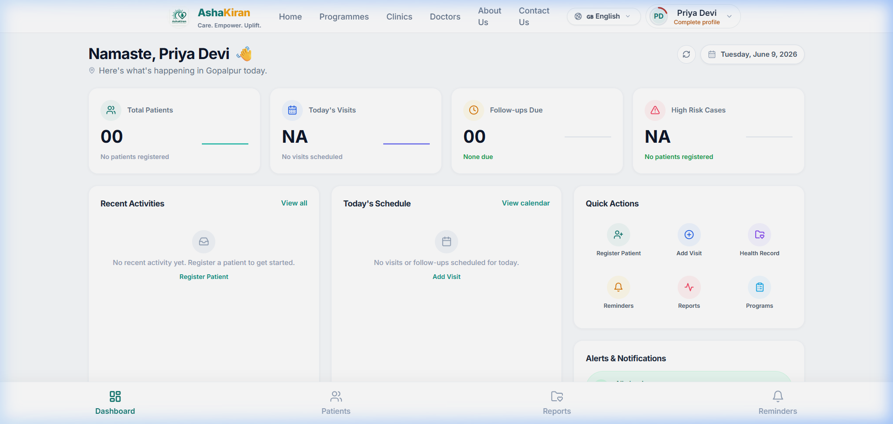
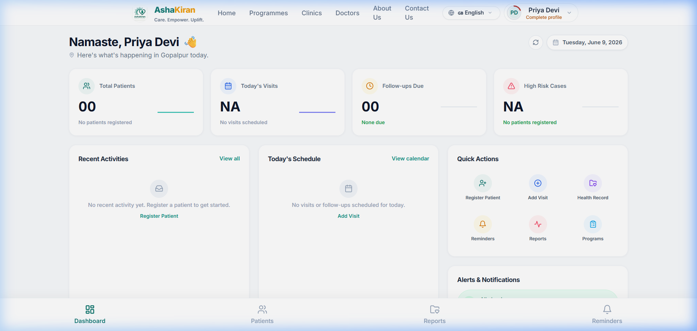
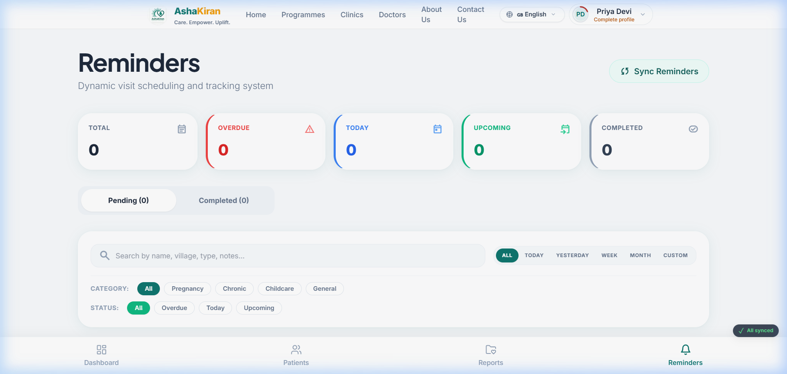
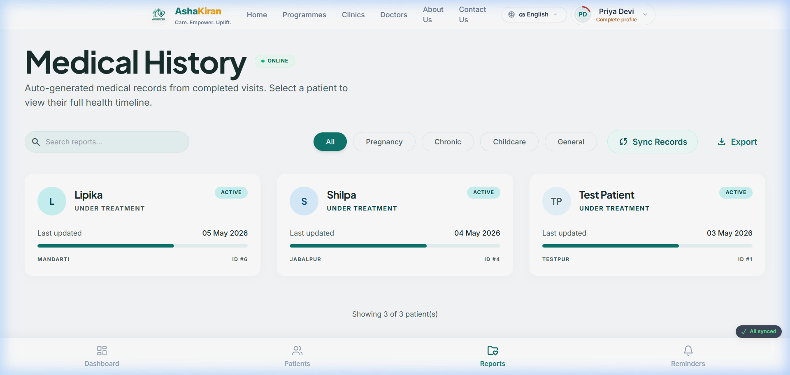
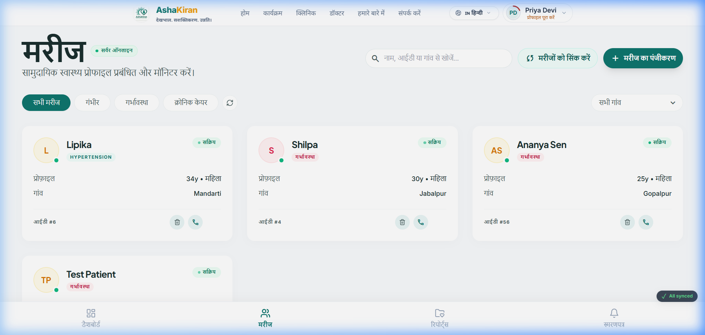
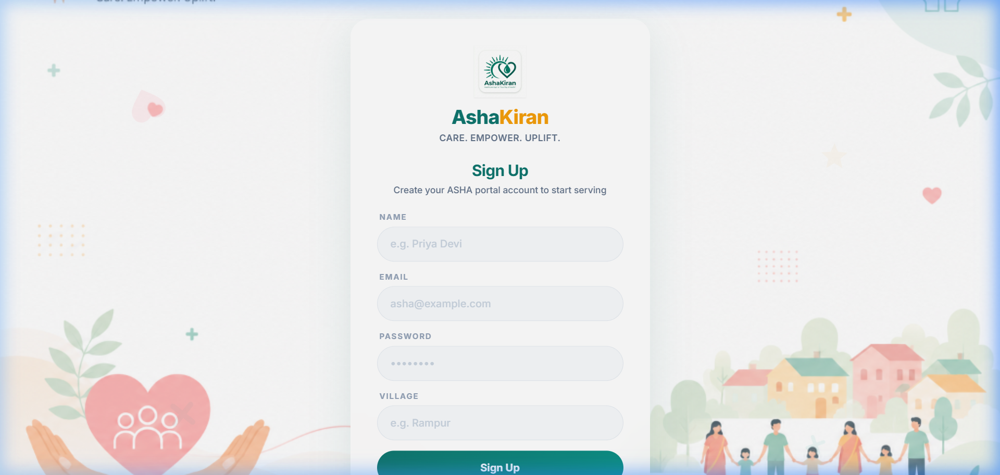
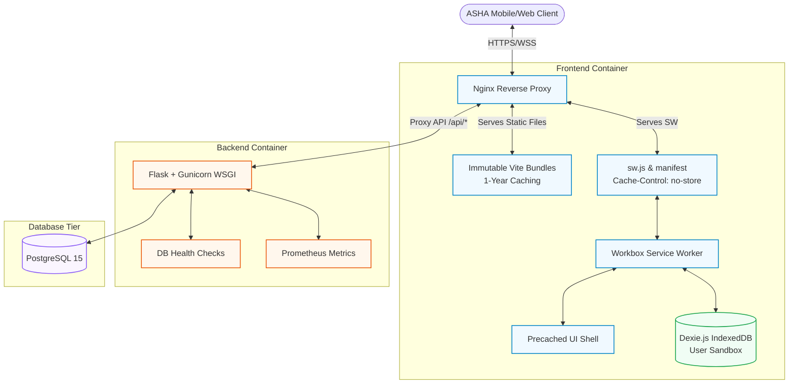

# 🏥 AshaKiran (आशाकिरण) — Electronic Health Record (EHR) & Management System

> **"Care. Empower. Uplift."**  
> A production-ready, enterprise-grade, offline-first clinical registry and synchronization platform designed specifically for Accredited Social Health Activists (ASHA) workers in remote rural regions of India.

---

## 📋 Table of Contents
1. [Problem Statement](#-problem-statement)
2. [Solution Overview](#-solution-overview)
3. [Key Features](#-key-features)
4. [Screenshots Gallery](#-screenshots-gallery)
5. [Architecture & Tech Stack](#-architecture--tech-stack)
6. [Offline-First Sync Engine Deep-Dive](#-offline-first-sync-engine-deep-dive)
7. [Docker & Container Orchestration](#-docker--container-orchestration)
8. [Installation & Developer Setup](#-installation--developer-setup)
9. [Environment Configuration Reference](#-environment-configuration-reference)
10. [Production Deployment & Security Hardening](#-production-deployment--security-hardening)
11. [Future Roadmap](#-future-roadmap)
12. [Author & License](#-author--license)

---

## 📌 Problem Statement

In India, over **1 million ASHA (Accredited Social Health Activist) workers** act as the primary interface between rural communities and the public health system. They manage critical activities including door-to-door maternal checks, pediatric vaccinations, and chronic disease tracking. 

However, ASHA workers operate under severe technical constraints:
- **Intermittent & Absent Connectivity:** Valleys, remote villages, and rural regions frequently suffer from zero cellular signal or spotty edge connectivity.
- **Power Grid Disruption:** Frequent, prolonged power cuts prevent local clinical servers or desktops from remaining online.
- **Hardware Limitations:** ASHA workers typically utilize low-end, budget-tier Android devices with restricted memory (2GB–4GB RAM) and weak processors.
- **Stale PWA Caches & Sudden Session Drops:** Traditional web platforms fail under these conditions, logging out users mid-check or locking them out of cached interfaces when offline.

This creates a high risk of clinical data loss, duplicate records, and inefficient field visits.

---

## 💡 Solution Overview

**AshaKiran** (meaning *"Ray of Hope"*) addresses these challenges by transforming the standard EHR application into an **offline-first powerhouse**. It allows healthcare workers to operate entirely offline in remote field deployments with 100% data durability.

### Core Architecture Goals:
1. **Local Autonomy:** Clinicians can search, read, write, and modify patient charts, clinical visits, and immunization logs without an active internet connection.
2. **Deterministic Sync Queue:** An isolated, transaction-backed local outbox queues operations. Once connection is established, changes sync with zero loss or duplication.
3. **Optimized Client Performance:** Pure client-side calculations, slim bundles, and aggressive caching minimize processing overhead on budget Android hardware.
4. **Resilient User Sessions:** Authenticated state is cached securely in local sandboxes to prevent lockouts during sudden connection drops.

---

## 🌟 Key Features

- **IndexedDB & Dexie Local Storage:** Encrypted-at-rest sandboxed IndexedDB namespaces that isolate clinician data per user session.
- **Robust Background Synchronization:** An active synchronization queue that detects online status changes and pushes records transparently.
- **Visual Diagnostics & Troubleshooting Console:** A self-healing dashboard displaying IndexedDB storage size, network latency ping, active Service Worker scopes, and manual outbox sync controls.
- **Multilingual Localization System:** Built-in localization support for **10 Indian languages** (Hindi, Kannada, Tamil, Telugu, Malayalam, Bengali, Marathi, Gujarati, Punjabi, and English) with runtime language hot-swapping.
- **Intelligent Reminders Engine:** Local calculations generate patient follow-up alerts, maternal checkups, and vaccine dates directly inside IndexedDB, independent of backend triggers.
- **Security Hardening:** Implements strict client-side isolation, bcrypt credentials, cookie/JWT protection, and rigorous Nginx Content Security Policies (CSPs).

---

## 📸 Screenshots Gallery

### 1. Dashboard Analytics & System Health
Displays real-time server analytics side-by-side with local IndexedDB sync states and database metrics.


### 2. Patient Management & Checkup Registries
Clean, mobile-responsive grids allowing clinicians to search, filter, and modify profiles offline.


### 3. Patient Reminders & Schedule Planning
Intelligent local tracking for immunization appointments and prenatal visits.


### 4. Clinic Reports & Multilingual Localization
Generates summary reports and runs regional localization across 10 major Indian languages.
| Clinical Health Reports | Regional Language Translations |
| :---: | :---: |
|  |  |

### 5. Secure Authentication & Registration System
Secures sessions with secure JWT-based protocols.
| Login Panel | Patient Signup & Registration |
| :---: | :---: |
|  |  |

---

## ⚙️ Architecture & Tech Stack

The platform is designed with a decoupled 3-tier structure orchestrated via Docker.



### Technical Specifications:
* **Frontend:**
  * **Framework:** React 18 with Vite.
  * **Styling:** CSS3 & TailwindCSS (fully responsive layout optimized for mobile screens).
  * **Local Database:** Dexie.js (wrapper for IndexedDB) providing safe transactions and schema upgrades.
  * **PWA Engine:** Workbox-powered Service Workers managing custom precaching, network-first caching, and offline fallbacks.
  * **Localization:** `i18next` with async JSON translation bundles.
* **Backend:**
  * **Framework:** Flask (Python 3.11).
  * **WSGI Server:** Gunicorn (multithreaded backend server).
  * **Database ORM:** SQLAlchemy with connection pooling (tuned for low-RAM limits).
  * **Security:** JWT Authentication, Bcrypt password hashing.
* **Infrastructure & DevOps:**
  * **Reverse Proxy:** Nginx (manages routing, TLS termination, gzip, security headers, and caching).
  * **Orchestration:** Docker Compose bridge network.
  * **Monitoring:** Prometheus `/metrics` endpoints and integrated Sentry telemetry.

---

## 🔄 Offline-First Sync Engine Deep-Dive

The offline synchronization engine is the core innovation of AshaKiran, ensuring clinical files and patient records remain consistent regardless of network stability.

```
 [Client Offline Actions]
           │
           ▼
┌──────────────────────┐
│  IndexedDB Sandbox   │ ◄── Enforces multi-user data isolation (User-Scoped Sandbox)
└──────────┬───────────┘
           │ Writes outbox transaction
           ▼
┌──────────────────────┐
│  Outbox Sync Queue   │ ◄── Tracks local changes, UUIDs, and operations (POST/PATCH/DELETE)
└──────────┬───────────┘
           │
           │ Network status returns ONLINE
           ▼
┌──────────────────────┐
│   Sync Coordinator   │ ◄── Processes outbox sequentially, locks queue using Mutex
└──────────┬───────────┘
           │
           │ Sends Payload to Backend (/api/sync)
           ▼
┌──────────────────────┐
│  Flask API Gateway   │ ◄── Validates UUIDs. Returns 409 Conflict if record exists on server
└──────────┬───────────┘
           │
           │ Confirms database commit
           ▼
┌──────────────────────┐
│  PostgreSQL Server   │ ◄── Persists transaction. Returns new server-mapped ID
└──────────────────────┘
```

### 1. User-Scoped Sandbox Isolation
AshaKiran isolates the client-side IndexedDB database name (`AshaKiran_v3`). Every table row (Patients, Visits, Reminders, Outbox Queue) is stamped with the active clinician's `userId`. If multiple health workers share a single tablet or phone, their offline data remains separated, preventing unauthorized cross-user access.

### 2. Mutex-Locked Outbox Queue
When a user adds a patient or writes a visit report offline:
- The item is instantly written to the local cache table for immediate UI rendering.
- A transaction is written to the `syncQueue` table, detailing the HTTP method, resource path, UUID (`local_id`), creation timestamp, and JSON body payload.
- The **Sync Coordinator** uses a mutex lock to serialize outbox execution. This prevents race conditions or out-of-order execution if the network status bounces rapidly between online and offline.

### 3. Idempotency & Conflict Resolution
To prevent database duplication during network reconnects:
- All client records generate a cryptographic UUID (`local_id`) upon creation.
- When syncing, the Flask backend validates the `local_id`. If the server has already persisted this UUID, it bypasses insertion and returns a `409 Conflict` containing the server ID.
- The client receives the server response, links the local record to the official server ID, deletes the outbox entry, and updates the local state.

### 4. PWA Service Worker Optimizations
Using Vite PWA plugins and Workbox strategies:
- **UI Shell Pre-caching:** Pre-caches all HTML, JS, CSS, and localized JSON translations.
- **Offline Fallback Routing:** If a worker navigates to an uncached page while offline, the service worker intercepts the request and serves a pre-cached offline template page.
- **Aggressive Cache Control:** Serves fingerprinted assets with 1-year cache headers (`Cache-Control: public, max-age=31536000, immutable`). The manifest file (`manifest.webmanifest`) and service worker script (`sw.js`) are served with `Cache-Control: no-store` to ensure instant client updates when a new version is published.

### 5. Manual Rescue Sync System
In case automatic network detection fails or the Service Worker background sync sync is delayed, the Diagnostics panel provides a **"Sync Now"** manual override button. This forcefully dumps the outbox, triggers validation pings, and updates sync stats in the user interface.

---

## 🐳 Docker & Container Orchestration

AshaKiran utilizes a multi-container Docker configuration managed via `docker-compose.yml`.

### Infrastructure Components:
- **`db` (Postgres 15):** Exposes no public host ports. Relies on internal bridge network for backend database interactions.
- **`backend` (Flask + Gunicorn):** Run under non-root `flaskuser:flaskgroup` (UID `10001`). It connects to Gunicorn using configuration file `backend/gunicorn.conf.py`.
- **`frontend` (Nginx Reverse Proxy):** Serves built React frontend assets, applies security rules, and routes API queries.

### Shared Configuration & Contexts:
To avoid duplicate configs, the `frontend` container is built using the root directory context `.`, allowing the Dockerfile to import the global `nginx/nginx.conf` directly. A root `.dockerignore` filters out database data, Python packages, node modules, and credentials to keep builds fast and secure.

---

## 🚀 Installation & Developer Setup

### Prerequisites
- Install **Docker & Docker Compose** on your development machine.
- Install **Node.js v20+** and **Python 3.11+** if running services locally.

### 1. Launch with Docker Compose (Recommended)
1. Clone the repository:
   ```bash
   git clone https://github.com/shetty-aditya-udaya/AshaKiran-Electronic-Health-Record-Management-System.git
   cd AshaKiran-Electronic-Health-Record-Management-System
   ```
2. Copy the environment variables template:
   ```bash
   cp .env.example .env
   # Customize variables and secrets in .env
   ```
3. Run the container stack:
   ```bash
   docker compose up --build -d
   ```
4. Verify that the services are online:
   ```bash
   docker compose ps
   ```
5. View container output logs:
   ```bash
   docker compose logs -f
   ```
6. Stop the services:
   ```bash
   docker compose down
   ```

### 2. Manual Local Development Setup
If you want to run the frontend and backend services directly on your host machine:

#### Backend Server
1. Navigate to the backend directory:
   ```bash
   cd backend
   ```
2. Create and activate a Python virtual environment:
   ```bash
   python -m venv venv
   source venv/bin/activate  # On Windows: venv\Scripts\activate
   ```
3. Install dependencies:
   ```bash
   pip install -r requirements.txt
   ```
4. Configure database and environment variables in `.env` (copy from `.env.example`).
5. Run the development server:
   ```bash
   python run.py
   ```

#### Frontend Client
1. Navigate to the frontend directory:
   ```bash
   cd frontend
   ```
2. Install Node packages:
   ```bash
   npm install
   ```
3. Run the Vite development server:
   ```bash
   npm run dev
   ```

---

## 📝 Environment Configuration Reference

The application is configured using environment variables specified in `.env` (for Docker) or local `.env` files.

| Variable Name | Required In | Description | Example / Default Value |
| :--- | :---: | :--- | :--- |
| `FLASK_ENV` | Backend | Environment flag (`production` or `development`) | `production` |
| `FLASK_DEBUG` | Backend | Enable/disable hot reloading & debugger logs | `false` |
| `SECRET_KEY` | Backend | Flask application key for session cryptography | `production-secret-key-change-me` |
| `JWT_SECRET_KEY` | Backend | Secret key used for signing JWT login tokens | `production-jwt-secret-key-change-me` |
| `DATABASE_URL` | Backend | Connection URI for the database server | `postgresql://postgres:pass@db:5432/ashakiran` |
| `CORS_ORIGINS` | Backend | Allowed cross-origin domains for external clients | `*` |
| `PORT` | Frontend | Host port mapping for Nginx frontend service | `80` |

---

## 🔒 Production Deployment & Security Hardening

### Multi-Cloud Deployment Guide

#### 1. Frontend Client Hosting (Static)
- **Platforms:** Vercel, Netlify, or AWS S3 CloudFront.
- **Configuration:** Build the frontend using `npm run build` and direct the hosting platform to output the `dist/` directory. Specify `VITE_API_BASE_URL` pointing to your backend API gateway.

#### 2. Backend Web Service
- **Platforms:** Railway, Render, or Heroku.
- **Configuration:** Deploy the backend using the provided `backend/Dockerfile`. Set up your database environment variables within the hosting console. Ensure your database connection enables SSL options.

#### 3. Standard Virtual Private Server (VPS) Docker Setup
For single-instance VPS deployments (Ubuntu/Debian):
1. Install Docker and Nginx on the host machine.
2. Route domains using Nginx to point port `80` requests to the React + Nginx container.
3. Install **Certbot** on the host machine to obtain a free SSL certificate from **Let's Encrypt**:
   ```bash
   sudo certbot --nginx -d yourdomain.com
   ```
4. Ensure the proxy configuration passes SSL headers (`X-Forwarded-Proto $scheme`) so Flask knows it is serving over HTTPS.

### Production Security Configuration (Nginx level)
AshaKiran enforces strict security headers at the Nginx layer in [nginx.conf](file:///c:/AshaKiran/nginx/nginx.conf) to prevent attacks:
- **`X-Frame-Options: DENY`**: Blocks clickjacking attacks.
- **`X-Content-Type-Options: nosniff`**: Disables mime-sniffing.
- **`X-XSS-Protection "1; mode=block"`**: Enables default browser XSS blocks.
- **`Content-Security-Policy`**: Restricts resource fetching to self, safe fonts, and active API endpoints:
  ```nginx
  add_header Content-Security-Policy "default-src 'self'; script-src 'self' 'unsafe-inline' 'unsafe-eval'; style-src 'self' 'unsafe-inline' https://fonts.googleapis.com https://cdn.jsdelivr.net; font-src 'self' https://fonts.gstatic.com; img-src 'self' data: http: https: blob:; connect-src 'self' http: https: ws: wss:;" always;
  ```

---

## 🔮 Future Roadmap

- [ ] **AI-Assisted Diagnostic Warnings:** Add offline-first risk assessment scoring for maternal checks based on blood pressure and symptoms.
- [ ] **Hardware Bluetooth Syncing:** Connect local Bluetooth devices (pulse oximeters, blood pressure monitors) directly to IndexedDB tables.
- [ ] **USSD Texting Fallback:** Allow offline sync data transmission via basic cellular USSD protocols when GPRS/3G is unavailable for days.

---

## 👥 Author & License

### Author
- **Aditya Udaya Shetty**
- **Role:** Lead Systems Architect & Full Stack Engineer
- **GitHub:** [@shetty-aditya-udaya](https://github.com/shetty-aditya-udaya)
- **Contact:** aditya.shetty@example.com

### License
This project is licensed under the **MIT License** - see the [LICENSE](file:///c:/AshaKiran/LICENSE) file for details.
🏥 AshaKiran: Made with care for the frontline health workers of India.
